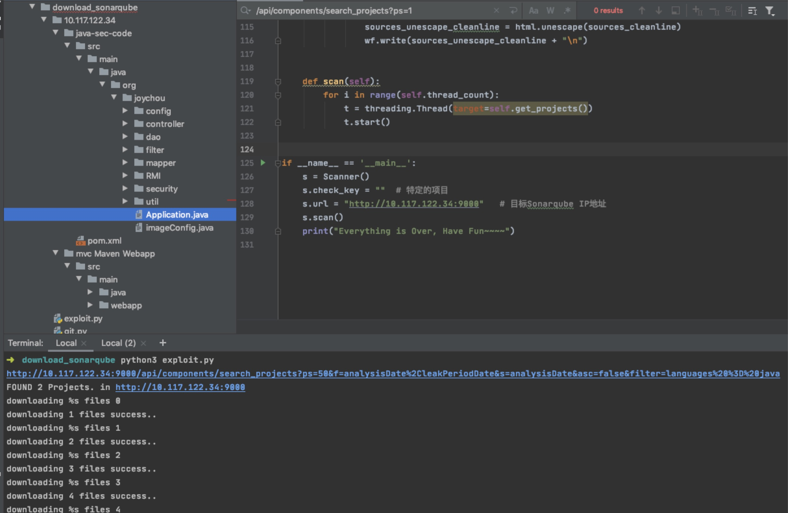
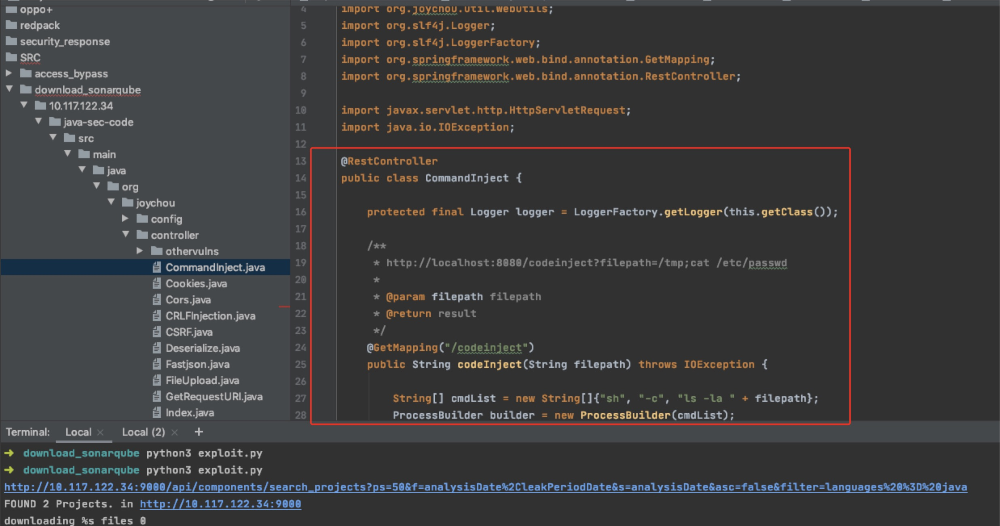

## Sonarqube 9000端口，扫描引擎未授权访问漏洞利用工具「下载源码」

外文报道：

https://www.bleepingcomputer.com/news/security/fbi-hackers-stole-government-source-code-via-sonarqube-instances/

### 1、如何找到Sonarqube
- 可以使用这个shando脚本：

https://github.com/random-robbie/My-Shodan-Scripts/blob/3639d05e0d6a4cfdba0dc1873474466c2ba4ba45/SonarQube/sonar.py

- 也可以使用Fofa搜索

语法：body="<title>SonarQube</title>"

### 2、如何使用脚本
 指定脚本中的目标地址，运行即可
 python3 exploit.py
 
 ### 3、效果
 
 
 
 

### 警告⚠️
🈲️ 止用于非法行为，仅用于红蓝对抗之信息收集，寻找突破口使用。
